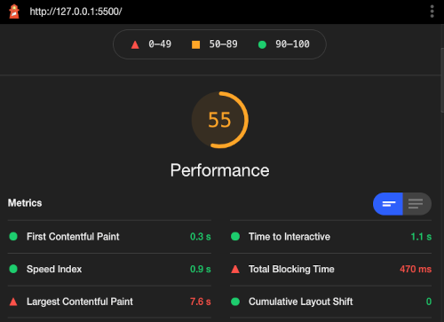
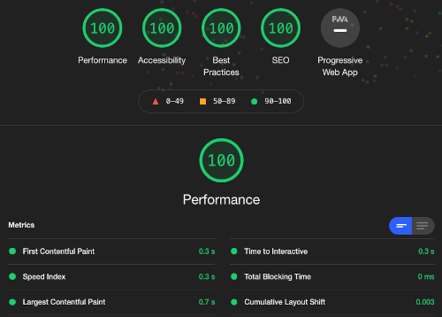
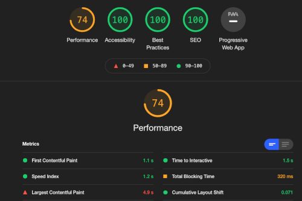

# Grid Image Gallery
A photo gallery in CSS Grid inspired by Pinterest or mood-board-style layouts.


## My Approach
Just as I was really starting to feel like I was understanding Flexbox --truly understanding it-- for the first time, I decided to step outside my comfort zone and try to learn CSS Grid. I knew the basics, but I had a nagging feeling that I had to dig deeper, which made me think this would be a frustrating exercise. To my surprise, I loved my time spent with Grid and really learned to appreciate how it makes complex layouts simple to implement. I still see the beauty of Flexbox, and I love its utility, but now I see that it has a very specific purpose. CSS Grid does the heavy lifting, while Flexbox gets into the places where CSS Grid just can't.

## Challenges
I actually had a lot of challenges and this project took longer than I assumed it would. In addition to CSS Grid, I knew I wanted to serve images in a responsive way, factoring device dimensions while keeping file sizes low. That said, responsive images are hard, and I read and experimented a lot before I could really understand what image attributes like `srcset` and `sizes` really do. I also took the time to annotate my images so that I could clearly see a difference between changes.

I ran a Lighthouse Report in Chrome developer tools so I'd have a baseline of what performance was like serving images in their intrinsic size despite CSS size being smaller:



By the end of the project, I was able to optimize the desktop version and learn some important things in the process:



The mobile version still left a lot to be desired, and there's a lot of considerations to be made here just from a design and planning perspective. These results would have really benefited from a mobile-first approach:



### Key Takeaways
* Device pixel ration (DPR) simulation on Firefox and Chromium doesn't seem to do anything. I did not see any changes in image quality when changing between them, perhaps I am doing something wrong. Instead I resorted to dragging the browser window between my standard monitor and my laptop's retina screen.
* Despite disabling cache on Chromium, the first image loaded was always used, even at smaller viewport sizes. Firefox changed images dynamically as viewport dimensions expanded and shrunk, so this is the browser I used for my testing.
* Declaring `font-display: swap` on a font face allows for rendering a fallback font while the external font is loading, which is good for performance. By default, when using web fonts, usually the text is invisible until either it is loaded or 3 seconds have elapsed, at which point the fallback font is used. This CSS directive gives the developer control over what happens here.
* `grid-auto-flow: dense` enables the dense-packing algorithm to place elements in the grid regardless of source order.
* I consider using `srcset` to specify DPR the most basic way to achieve responsive images. It "just works" but you may end up downloading unnecessarily large images on mobile devices like iPhones.
* `srcset` combined with width descriptors (e.g. `600w`) assume the image is the full width of the viewport. The algorithm that decides what image is used is simple to understand on standard screens and monitors (1.0 DPR). However, when dealing with a retina screen and thus increasing the DPR, the results of the algorithm will change:
```
 image size / viewport width = DPR
```
* The image attribute `sizes` can be used to implement media queries and conditional logic. This is actually ok to have in your HTML because when describing image dimensions, we are describing the content itself, not its styling.
